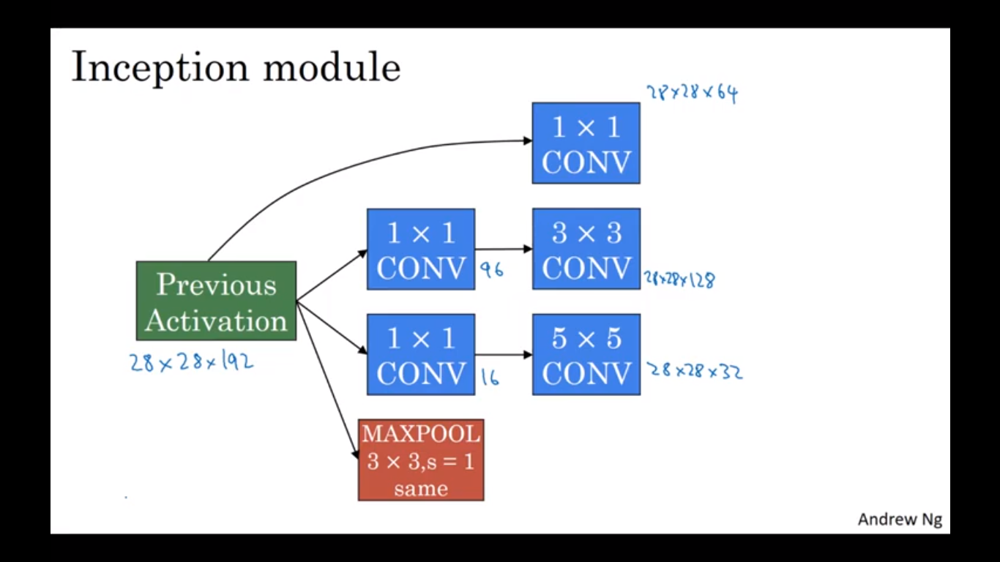
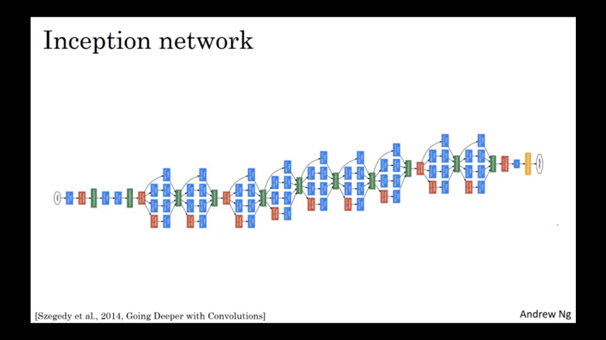

# Video-recognition-for-ASL.
***
This repo contains code building a action recognition model specifically for American Sign language.

## Understanding the `Inception` architecture.

### The `Inflated 3D CNN` model implemented for video recognition uses the `Inception` architecture for feature extraction.

### The repository for downloading the American Sign language dataset can be found [here.](https://github.com/dxli94/WLASL)
